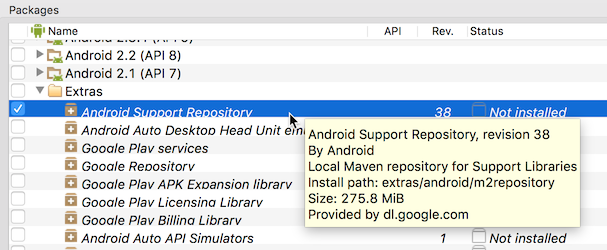
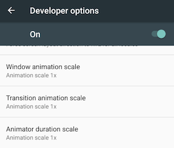
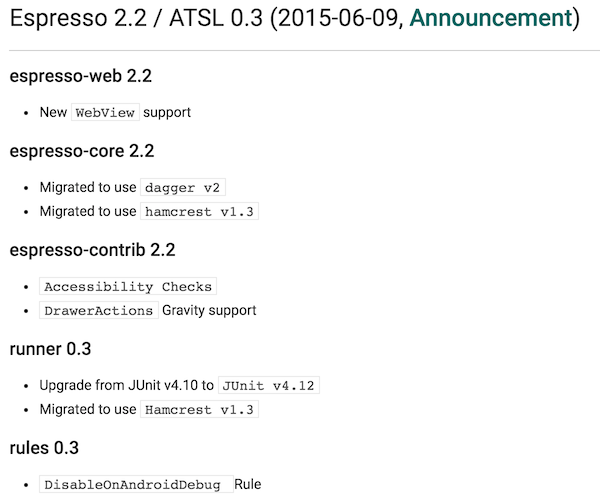
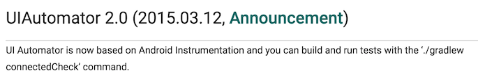

= 安裝設定

使用 Espresso 的準備工作有：

 * 安裝 Android Support Library
 * 調整測試裝置的設定
 * 調整 build file

== 安裝 Android Support Library

Espresso 做為 https://google.github.io/android-testing-support-library/[Android Testing Support Library (ATSL)] 的一部份，所以要先透過 Android SDK Manager 安裝 Extra > Android Support Repository：

它會在 `$ANDROID_HOME/extras/android/m2repository` 安裝一個 local Maven repository (假設環境變數 `ANDROID_HOME` 指向 Android SDK 安裝的位置)，ATSL 相關的套件都在 `com/android/support/test` 底下：

----
$ tree -L 1 extras/android/m2repository/com/android/support/test/
extras/android/m2repository/com/android/support/test/
├── espresso
├── exposed-instrumentation-api-publish
├── janktesthelper
├── rules
├── runner
├── testing-support-lib
└── uiautomator

7 directories, 0 files

$ tree -L 1 extras/android/m2repository/com/android/support/test/espresso/
extras/android/m2repository/com/android/support/test/espresso/
├── espresso-contrib
├── espresso-core
├── espresso-idling-resource
├── espresso-intents
└── espresso-web

5 directories, 0 files

$ tree -L 1 extras/android/m2repository/com/android/support/test/uiautomator/
extras/android/m2repository/com/android/support/test/uiautomator/
└── uiautomator-v18

1 directory, 0 files
----

注意 `rules/`、`runner/`、`uiautomator-v18/` 及 `espresso-*/` 這些套件的位置，之後可能會用到。

== 調整測試裝置的設定

 * 取消螢幕鎖定。
 * 關閉動畫效果。
 * 讓測試裝置保持清醒。

螢幕鎖定會讓 UI 測試無法進行，將 Settings > Security > Screen lock 設定為 None 即可。

動畫效果可能會讓 UI 測試變得不穩定 (flaky)，建議將測試裝置的動畫效果關閉 (包括模擬器)。在 Settings > Developer options > Drawing 將下面 3 個選項都改為 Animation off 即可：

 * Window animation scale
 * Transition animation scale
 * Animator duration scale

最後一點則要讓測試裝置保持清醒 (至少在測試期間)，否則 UI 測試也無法進行。最簡單的方式是開啟 Settings > Developer options > Stay awake (Screen will never sleep while charging) 的設定 (為了避免損傷螢幕，建議一併將螢幕亮度也調到最低)，更多細節可以參考link:../troubleshooting/no-activities-in-stage-resumed.adoc[這裡]。

== 調整 Build File ==

在 app module 的 build file (通常是 `app/build.gradle`) 裡宣告 instrumentation runner：

.`app/build.gradle`
----
android {
    ...
    defaultConfig {
        testInstrumentationRunner "android.support.test.runner.AndroidJUnitRunner" // <1>
        // testInstrumentationRunnerArguments disableAnalytics: 'true' // <2>
    }
}
----
<1> https://developer.android.com/reference/android/support/test/runner/AndroidJUnitRunner.html[`AndroidJUnitRunner`] 做為 JUnit 的 https://github.com/junit-team/junit4/wiki/test-runners[test runner]，取代舊有的 https://developer.android.com/reference/android/test/InstrumentationTestRunner.html[`InstrumentationTestRunner`]，同時支援用 JUnit 3 與 JUnit 4 寫的測試。
<2> 為了統計 Espresso 的使用量，每次執行測試都會自動回報 (main) app package name 的 hash 到後端，如果你不想這麼做，只要將這一行反註解即可。

增加測試程式 (test code) 專用的相依性 (dependency)：

.`app/build.gradle`
----
dependencies {
    ...
    androidTestCompile 'com.android.support.test:runner:0.5' // <1>
    androidTestCompile 'com.android.support.test:rules:0.5'  // <2>
    androidTestCompile 'org.hamcrest:hamcrest-library:1.3'   // <3>
    androidTestCompile 'com.android.support.test.espresso:espresso-core:2.2.2' // <4>
    // androidTestCompile 'com.android.support.test.uiautomator:uiautomator-v18:2.1.2' // <5>
}
----
<1> `com.android.support.test:runner` 提供 test runner 相關的 API (https://developer.android.com/reference/android/support/test/runner/package-summary.html[`android.support.test.runner`])，主要是 `AndroidJUnit4` 與 `AndroidJUnitRunner`。
<2> `com.android.support.test:rules` 提供 Android 測試核心的 https://github.com/junit-team/junit4/wiki/rules[JUnit test rule] (https://developer.android.com/reference/android/support/test/rule/package-summary.html[`android.support.test.rule`])，例如 `ActivityTestRule`、`ServiceTestRule` 等。
<3> `org.hamcrest:hamcrest-library` 提供許多常用的 http://hamcrest.org/JavaHamcrest/javadoc/1.3/[Hamcrest API]，例如 `allOf()`、`not()` 等，可以用來組出複雜的搜尋或驗證條件。
<4> `com.android.support.test.espresso:espresso-core` 提供 https://developer.android.com/reference/android/support/test/espresso/package-summary.html[`android.support.test.espresso.*`] 大部份的 API。
<5> `com.android.support.test.uiautomator:uiautomator-v18` 提供 UI Automator 2.x API (https://developer.android.com/reference/android/support/test/uiautomator/package-summary.html[`android.support.test.uiautomator`])，test code 需要混用 UI Automator 時才需要加。

雖然 `com.android.support.test:runner`、`com.android.support.test:rules` 及 `org.hamcrest:hamcrest-library` 都是 https://android.googlesource.com/platform/frameworks/testing/+/android-support-test/espresso/core/build.gradle[`com.android.support.test.espresso:espresso-core` 的相依性] (transitive dependency)，不用明確宣告也可以使用相關的 API，但因為 test code 會直接用到它們，最好明確宣告為 direct dependency，避免 "used but undeclared" 的問題。

[NOTE]
====
加入這些 dependency 後，通常會遇到類似下面的 dependency 版本衝突：

----
Conflict with dependency 'com.android.support:support-annotations'. Resolved versions for app (24.0.0) and test app (23.3.0) differ. See http://g.co/androidstudio/app-test-app-conflict for details.
----

解決衝突的大原則是以 (main) app 為主，細節可以參考link:../resolving-conflicts-main-test-apps.adoc[這裡]。
====

上面提到 "大部份" 的 Espresso API 是由 `espresso-core` 提供，其他非核心的 API 則由不同的 module 擴充：

 * `espresso-intents` - 提供 intent 測試相關的 API (https://developer.android.com/reference/android/support/test/espresso/intent/package-summary.html[`android.support.test.espresso.intent.*`])。
 * `espresso-web` - 提供 WebView 測試相關的 API (https://developer.android.com/reference/android/support/test/espresso/web/webdriver/package-summary.html[`android.support.test.espresso.web.*`])。
 * `espresso-contrib` - 外部貢獻的 API (https://developer.android.com/reference/android/support/test/espresso/contrib/package-summary.html[`android.support.test.espresso.contrib`])，例如 `RecyclerViewActions`、`DrawerActions` 等。
 * `espresso-idling-resource` - 主要提供 (main) app 實作 link:../idling-resource/README.adoc[idling resource 機制]的 API，目前只有一個 https://developer.android.com/reference/android/support/test/espresso/IdlingResource.html[`android.support.test.espresso.IdlingResource`]。

這些 dependency 可以視需要再加入：

----
dependencies {
    ...
    compile 'com.android.support.test.espresso:espresso-idling-resource:2.2.2' // <1>
    androidTestCompile 'com.android.support.test.espresso:espresso-intents:2.2.2'
    androidTestCompile 'com.android.support.test.espresso:espresso-core:2.2.2'
    androidTestCompile 'com.android.support.test.espresso:espresso-contrib:2.2.2'
}
---- 
<1> 注意 `espresso-idling-resource` 宣告成 `compile` dependency 而非 `androidTestCompile`，是因為 `IdlingResource` 通常由 (main) app 自己實作。

== 該用哪個版本？

知道要加哪些 dependency 之後，下一個問題是「有哪些版本可用？該用哪個版本？」。由於 Espresso 相關的 dependency 不少：

----
dependencies {
    ...
    androidTestCompile 'com.android.support.test:runner:0.5'
    androidTestCompile 'com.android.support.test:rules:0.5'
    androidTestCompile 'org.hamcrest:hamcrest-library:1.3'
    androidTestCompile 'com.android.support.test.espresso:espresso-core:2.2.2'
    androidTestCompile 'com.android.support.test.uiautomator:uiautomator-v18:2.1.2'
}
----

每個 module 的版號都不太一樣，要如何知道每個 module 有哪些版本可供選擇？其間的版本又要怎麼搭配才不會有問題？

這得從 ATSL、Espresso、Hamcrest 之間的關係說起。Espresso 只是 ATSL 的一部份，底下除了 UI Automator 之外，還有通用於 instrumented test 的 test runner 與 test rules，對照 ATSL 的 https://google.github.io/android-testing-support-library/downloads/release-notes/[release note] 與 http://android.googlesource.com/platform/frameworks/testing/+/android-support-test[source code] (UI Automator 的 source code 在https://android.googlesource.com/platform/frameworks/uiautomator/+/android-support-test[另一個地方]) 會發現：

 * Runner 與 rules 都是跟著 ATSL 的版號。
 * Espresso 有自己的版號，只要一有變動，ATSL 的版號也會跟著調整。
+

+
 * UI Automator 也有自己的版號，但不會連帶影響 ATSL 的版號
+
--
雖然 UI Automator 也是 ATSL 的一員，但它本身對 ATSL 的 runner、rules 等都沒有相依。

--

也就是說可以根據 release note 知道 Espresso 所有已釋出的版本，旁邊也會伴隨著新的 runner 及 rules 版號 (也就是 ATSL 的版號)。

至於 `hamcrest-library` 的版本，在 Espresso 2.2 / ATSL 0.3 (2015-06-09) 已經換成最新的 Hamcrest 1.3，短時間內應該也不會有新的版本可用。(Hamcrest 1.3 早在 2012-07-10 釋出，之後就再沒有新版了)

[TIP]
====
由於 ATSL 是以 local Maven repository 的形式存在 `$ANDROID_HOME/extras/android/m2repository` 底下，這意謂著也可以從 repository 找出可用的版本。例如：

----
$ tree -L 1 extras/android/m2repository/com/android/support/test/espresso/espresso-core/
extras/android/m2repository/com/android/support/test/espresso/espresso-core/
├── 2.0
├── 2.1
├── 2.2
├── 2.2.1
├── 2.2.2
├── 2.3-alpha
...
----

除了已釋出的版本，還多了 alpha 版本可以用。
====

